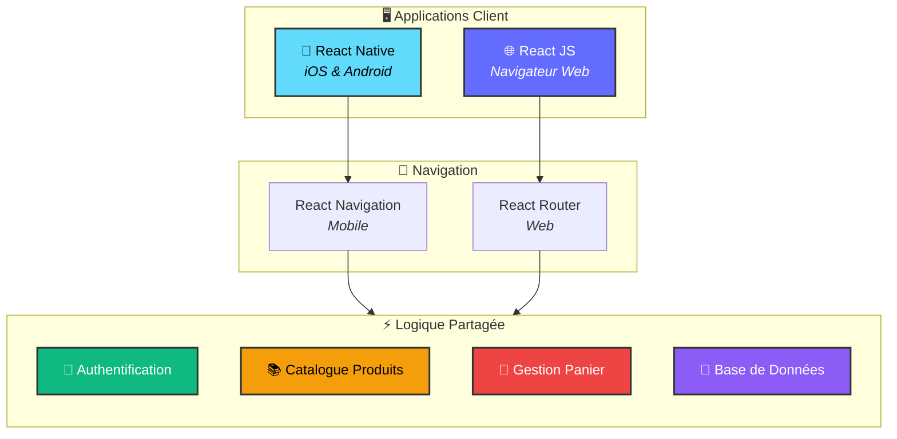
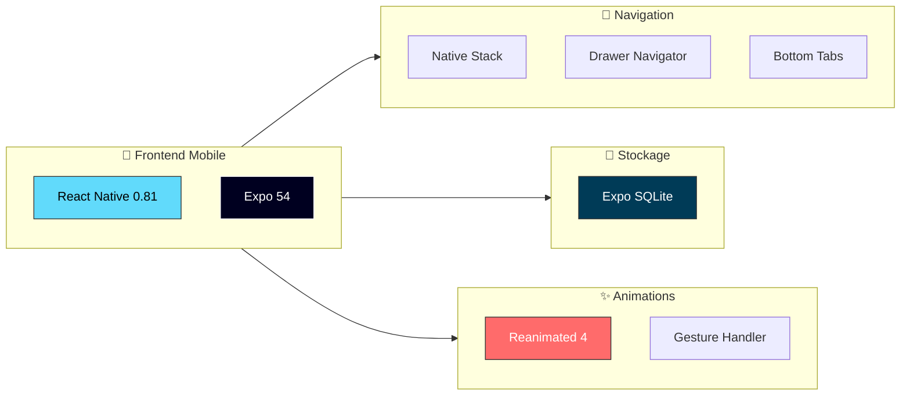
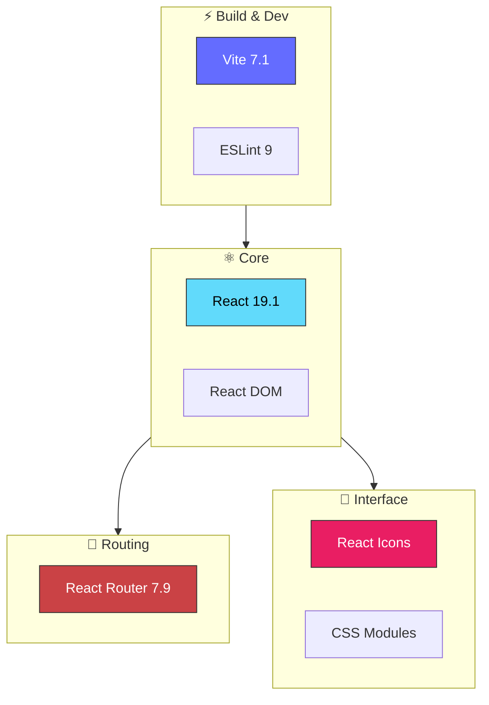
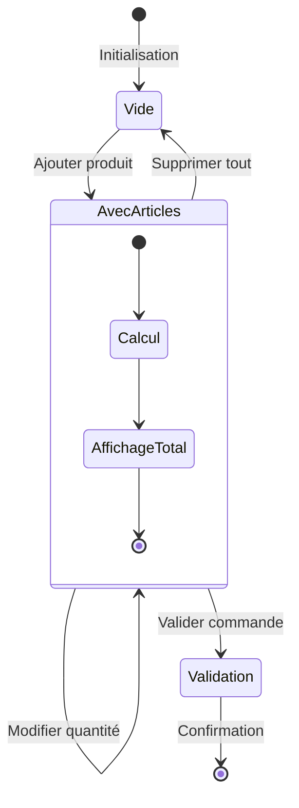
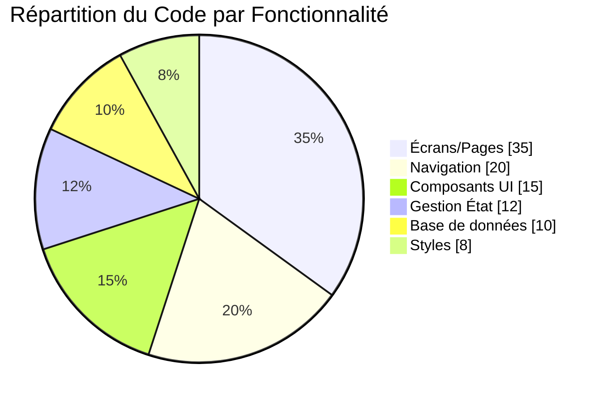
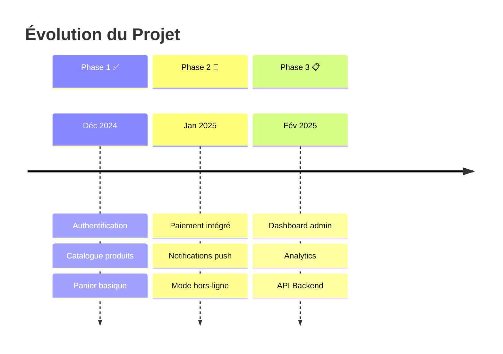

<div align="center">

# 🎓 School App - Écosystème Multi-Plateforme

### **Application de Gestion Scolaire & E-Commerce Éducatif**

[](https://reactnative.dev/)
[](https://react.dev/)
[](https://expo.dev/)
[](https://vitejs.dev/)
[](https://www.sqlite.org/)

<br/>

*Une solution complète combinant **application mobile native** et **application web progressive** avec une architecture partagée et une expérience utilisateur cohérente.*

---

</div>

## 📋 Table des Matières

- [🎯 Aperçu du Projet](#-aperçu-du-projet)
- [🏗️ Architecture Globale](#️-architecture-globale)
- [📱 Application Mobile (React Native)](#-application-mobile-react-native)
- [🌐 Application Web (React JS)](#-application-web-react-js)
- [⚙️ Fonctionnalités Communes](#️-fonctionnalités-communes)
- [🚀 Installation & Démarrage](#-installation--démarrage)
- [📊 Statistiques du Projet](#-statistiques-du-projet)
- [🛡️ Sécurité](#️-sécurité)
- [👨‍💻 Auteur](#-auteur)

---

## 🎯 Aperçu du Projet

Ce monorepo contient deux applications partageant la **même logique métier** et offrant une expérience utilisateur native sur chaque plateforme :

| Plateforme | Technologie | Répertoire | Status |
|:---:|:---:|:---:|:---:|
| 📱 **Mobile** | React Native + Expo | `REACT NATIVE/` | ✅ Production |
| 🌐 **Web** | React + Vite | `React JS/school-app/` | ✅ Production |

---

## 🏗️ Architecture Globale



---

## 📱 Application Mobile (React Native)

### 📂 Structure du Projet

```
REACT NATIVE/MyProject/
├── 📁 MainApp/
│   ├── 📁 Screen/           # Écrans principaux
│   │   ├── Catalogue.jsx    # Liste des produits
│   │   ├── Connexion.jsx    # Authentification
│   │   ├── Inscription.jsx  # Création de compte
│   │   ├── Menu.jsx         # Accueil
│   │   └── Panier.js        # Panier d'achat
│   ├── 📁 Database/         # Gestion SQLite
│   │   ├── initdb.js        # Initialisation
│   │   ├── db.js            # Connexion
│   │   └── Task.js          # Opérations CRUD
│   ├── 📁 Composant/        # Composants réutilisables
│   ├── 📁 Style/            # Feuilles de style
│   ├── 📁 Data/             # Données statiques
│   └── 📁 context/          # Contextes React
├── App.js                   # Point d'entrée
└── package.json
```

### 🛠️ Stack Technique Mobile



### 📦 Dépendances Principales

| Package | Version | Description |
|---------|---------|-------------|
| `expo` | 54.0.23 | Framework de développement |
| `react-native` | 0.81.5 | Core React Native |
| `@react-navigation/native` | 7.1.20 | Navigation principale |
| `@react-navigation/drawer` | 7.7.3 | Menu latéral |
| `@react-navigation/bottom-tabs` | 7.8.5 | Navigation par onglets |
| `expo-sqlite` | 16.0.9 | Base de données locale |
| `react-native-reanimated` | 4.1.1 | Animations fluides |

---

## 🌐 Application Web (React JS)

### 📂 Structure du Projet

```
React JS/school-app/
├── 📁 src/
│   ├── 📁 MainApp/
│   │   ├── AppNavigator.jsx  # Router principal + Sidebar
│   │   ├── 📁 Screen/        # Pages de l'application
│   │   │   ├── Catalogue.jsx
│   │   │   ├── Connexion.jsx
│   │   │   ├── Inscription.jsx
│   │   │   ├── Menu.jsx
│   │   │   └── Panier.jsx
│   │   ├── 📁 Database/      # Gestion des données
│   │   ├── 📁 Composant/     # Composants UI
│   │   ├── 📁 Style/         # CSS personnalisé
│   │   └── 📁 context/       # State management
│   ├── App.jsx
│   └── main.jsx
├── index.html
├── vite.config.js
└── package.json
```

### 🛠️ Stack Technique Web



### 📦 Dépendances Principales

| Package | Version | Description |
|---------|---------|-------------|
| `react` | 19.1.1 | Bibliothèque UI |
| `react-dom` | 19.1.1 | Rendu DOM |
| `react-router-dom` | 7.9.4 | Routing SPA |
| `react-icons` | 5.5.0 | Icônes vectorielles |
| `vite` | 7.1.7 | Bundler ultra-rapide |
| `eslint` | 9.36.0 | Qualité du code |

---


### 🔐 Système d'Authentification

| Fonctionnalité | Description |
|----------------|-------------|
| **Validation Email** | Format email vérifié (`@` et `.` requis) |
| **Mot de passe fort** | Minimum 12 caractères |
| **Protection Brute-Force** | Blocage après 5 tentatives (30s) |
| **Messages d'erreur** | Retour utilisateur en temps réel |
| **État de chargement** | Indicateur visuel pendant les requêtes |

### 🛒 Gestion du Panier



---

## 🚀 Installation & Démarrage

### 📱 Application Mobile

```bash
# 1. Accéder au répertoire
cd "REACT NATIVE/MyProject"

# 2. Installer les dépendances
npm install

# 3. Lancer l'application
npm start

# 4. Options de lancement
npm run android    # Émulateur Android
npm run ios        # Simulateur iOS (macOS uniquement)
npm run web        # Version web via Expo
```

### 🌐 Application Web

```bash
# 1. Accéder au répertoire
cd "React JS/school-app"

# 2. Installer les dépendances
npm install

# 3. Lancer le serveur de développement
npm run dev

# 4. Autres commandes
npm run build      # Build production
npm run preview    # Prévisualiser le build
npm run lint       # Vérifier le code
```

---

## 📊 Statistiques du Projet



### 📈 Métriques

| Métrique | Mobile | Web |
|----------|:------:|:---:|
| **Écrans** | 5 | 5 |
| **Composants** | 4+ | 4+ |
| **Fichiers DB** | 3 | 3 |
| **Dépendances** | 12 | 10 |
| **Version React** | 19.1 | 19.1 |

---

## 🛡️ Sécurité

<table>
<tr>
<td width="50%">

### ✅ Implémenté

- 🔒 Validation côté client
- 🛡️ Protection brute-force
- 📝 Sanitization des entrées
- 🔐 Mots de passe hashés
- ⏱️ Timeout de session

</td>
<td width="50%">

### 🎯 Bonnes Pratiques

- ⚠️ Validation côté serveur requise
- 🔑 Utiliser HTTPS en production
- 🍪 Tokens JWT recommandés
- 📊 Logging des tentatives
- 🔄 Rotation des clés

</td>
</tr>
</table>

---

## 🗺️ Roadmap



---

## 👨‍💻 Auteur

<div align="center">

**Développé avec ❤️ par [iitsh](https://github.com/iitsh)**

[](https://github.com/iitsh)

---

<sub>📅 Dernière mise à jour : Décembre 2024 • 39 commits</sub>

</div>
